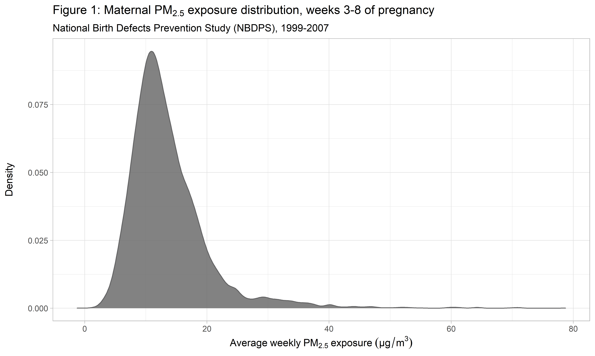
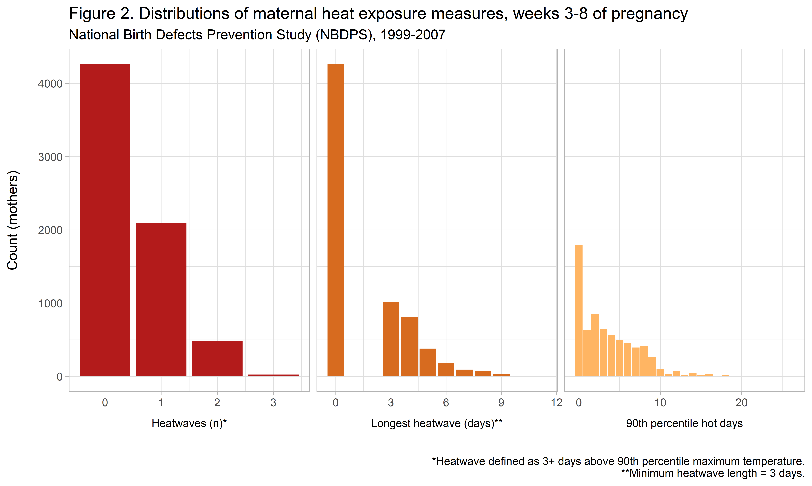

## 0.  Description

This document contains sample code for Programmer Analyst I role with Weill Cornell Medicine's Division of Biostatistics (Department of Population Health Sciences). 

The purpose of these analyses is to produce exploratory, descriptive, and analytic results related to the joint effects of maternal exposure to PM~2.5~ (fine particulate matter) and extreme heat events (EHE) on risk of certain offspring congenital heart defects (CHDs).

The starting dataset was provided by researchers at the National Birth Defects Prevention Study's New York center. It includes CHD cases and controls with estimated dates of delivery from 1997-2007. It also includes PM~2.5~ and temperature data, matched to each mother by geocode, as well as observed covariates. There	are a number of extraneous variables in the dataset.

## 1.  Setup

<!-- #### 1.0  Importing Packages -->


### 1.1.  Data Import and Cleaning

Here, I'll import the data used by my mentor to publish her 2019 study (Stingone et al. 2019, *Environ. Epidem.*). 


```r
# NOTE: ./data/ in this .Rproj is set up as a symbolic link to an unshared external data folder (data contain PHI)

ny_data =  # Starting dataset from NY NBDPS center - import from SAS format
  haven::read_sas(
    here::here("data", "ny_data_2019.sas7bdat")  # here::here() allows relative filepaths
  ) %>%   
  janitor::clean_names()
```

### 1.2.  Data Tidying and Manipulation

Most of this code is subsetting the original dataset of 6,000 columns into a more manageable dataset of the `ncol(study_data)` variables I'll use for analysis. In the first section of code, I used `pivot_longer()` and `summarize()` to create an index of heat days experienced by each mother during the cardiac critical period of pregnancy (weeks 3-8, or days 15-56).

The data contain PHI, so I also modified my study data for these purposes by permuting categorical counfounding variables and adding random noise to the numeric PM~2.5~ measurement. This was requested by NBDPS in sharing these analyses.


```r
# Creating exposure data for each ID: sum of >90th percentile heat days 15-56 (weeks 3-8 of pregnancy)
heat_days =
  ny_data %>% 
  select(
    matches("^tmax_p90_"),  # Selects all relevant tmax indicator variables, puts them together + in order
    everything()
  ) %>%
  pivot_longer(
    cols = tmax_p90_15:tmax_p90_56,  # Tidying data into long format to sum range of days for each ID
    names_prefix = "tmax_p90_",
    names_to = "preg_day",
    values_to = "heat_90_ind"
  ) %>% 
  group_by(id) %>%  # Group by mother's unique identifier
  summarize(
    heat_days_90 = sum(heat_90_ind)  
  ) %>% 
  ungroup() %>% 
  # mutate_all(
  #   ~as.factor(.)  # Coercing ID and heat days into factors 
  # )
  mutate(id = as.factor(id))

# Creating study dataset - selecting relevant columns from the original 6000 in full data
study_data =  
  ny_data %>% 
  select(
    id,
    pm25mean,  # PM2.5 exposure variable already created  
    longest_heatwave = heat90pconsec,
    heatwave_90 = heatwave90pn,
    lvoto, rvoto_noebstein, conotruncal, vsdpm, asd2, septal,  # CHDs of interest
    mean_dp,  # Mean dewpoint (degrees C)
    gender = c_gender,  # 1 [male], 2 [female], -3 [not stated], -4 [missing]
    age_cat = catage_c,  # 0 [<= 19], 1 [20-34 inclusive], 2 [> 34]
    race_cat = matrace,  # 0 [white non-Hisp], 1 [Black non-Hisp], 2 [Hisp], 3 [others: API, AK Native, Nat Am, other]
    educ_cat = mat_educ,  # 0 [> grade 12], 1 [<= grade 12]
    preg_hotseason,  # 0 [no days of gestational wks. 3-8 during spring/summer], 1 [1+ day]
    loc_id  # Transformed into US state below
  ) %>% 
  mutate(
    state = case_when(     
      loc_id == 10 ~ 'AR',
      loc_id == 11 ~ 'CA',
      loc_id == 12 ~ 'IA',
      loc_id == 15 ~ 'NY',
      loc_id == 16 ~ 'TX',
      loc_id == 17 ~ 'GA', 
      loc_id == 18 ~ 'NC',
      loc_id == 19 ~ 'UT')
  ) %>% 
  select(-loc_id) %>% 
  mutate_at(
    vars(-pm25mean, -mean_dp),
    ~as.factor(.)  # Coercing variables into factors where appropriate (all but numeric vars PM2.5, dewpoint)
  ) %>% 
  inner_join(  # Joining with heat day exposure variable df created above
    heat_days,
    by = "id"
  ) %>% 
  select(id, pm25mean, heat_days_90, everything())  # Reordering to put exposures first

# Adding permuting confounding variables and adding random noise to PM2.5 (requested by NBDPS)
set.seed(1)
study_data_mod =
  study_data %>% 
  mutate_at(
    vars(13:18),
    list(~sample(., replace = FALSE))  # Replaces columns 10:16 with random samples without replacement
  ) %>%
  mutate(
    pm25mean = pm25mean + rnorm(length(pm25mean), 0, 1)  # Adds Gaussian random noise to PM2.5 variable
  )
```

## 2.  Exploration

This section contains exploratory visualization of my primary variables: an outcome (congenital heart defect case-status) and two primary exposures (maternal PM~2.5~ and extreme heat exposure). 

### 2.1.  Outcome: congenital heart defects (CHDs)

First, I'll create a table of case counts by CHD subtype.


```r
# Character vector of CHD variables
chd = c("lvoto", "rvoto_noebstein", "conotruncal", "septal", "vsdpm", "asd2")

# Character vector of CHD labels
chd_labs = c("LVOTO", "RVOTO (excl. Ebstein)", "Conotruncal", "Septal", "VSDpm", "ASD-II", "Control")

study_data_mod %>% 
  select(all_of(chd)) %>% 
  mutate_all(as.character) %>%  # Converting factor value to actual numeric value 
  mutate_all(as.numeric) %>% 
  mutate(
    case = rowSums(., na.rm = TRUE),  # Summing all columns for each row - if > 0, case
    control = case_when(case >  0 ~ 0,
                        case == 0 ~ 1)
  ) %>% 
  select(-case) %>% 
  colSums(na.rm = TRUE) %>%   # Difficult to use dplyr solution - CHDs not mutually exclusive, so sum using colSums()
  as_tibble() %>% 
  mutate(
    CHD = chd_labs
  ) %>% 
  select(CHD, n = value) %>% 
  
  # Creating table
  kable(
    caption = "<font size=2.6 style='color:black'><b>Table 1. Case-count by congenital heart defect (CHD)</b><br>National Birth Defects Prevention Study (NBDPS)</font>",
    escape = FALSE
  ) %>% 
  kable_styling(bootstrap_options = c("striped","hover","condensed"),
                full_width = FALSE) %>% 
  column_spec(1, width = "22em") %>% 
  footnote(
    general_title = " ",
    general = "<i>Note:</i> CHD categories not mutually exclusive.",
    escape = FALSE
  )
```

<table class="table table-striped table-hover table-condensed" style="width: auto !important; margin-left: auto; margin-right: auto;">
<caption><font size="2.6" style="color:black"><b>Table 1. Case-count by congenital heart defect (CHD)</b><br>National Birth Defects Prevention Study (NBDPS)</font></caption>
 <thead>
  <tr>
   <th style="text-align:left;"> CHD </th>
   <th style="text-align:right;"> n </th>
  </tr>
 </thead>
<tbody>
  <tr>
   <td style="text-align:left;width: 22em; "> LVOTO </td>
   <td style="text-align:right;"> 588 </td>
  </tr>
  <tr>
   <td style="text-align:left;width: 22em; "> RVOTO (excl. Ebstein) </td>
   <td style="text-align:right;"> 447 </td>
  </tr>
  <tr>
   <td style="text-align:left;width: 22em; "> Conotruncal </td>
   <td style="text-align:right;"> 639 </td>
  </tr>
  <tr>
   <td style="text-align:left;width: 22em; "> Septal </td>
   <td style="text-align:right;"> 958 </td>
  </tr>
  <tr>
   <td style="text-align:left;width: 22em; "> VSDpm </td>
   <td style="text-align:right;"> 407 </td>
  </tr>
  <tr>
   <td style="text-align:left;width: 22em; "> ASD-II </td>
   <td style="text-align:right;"> 420 </td>
  </tr>
  <tr>
   <td style="text-align:left;width: 22em; "> Control </td>
   <td style="text-align:right;"> 4225 </td>
  </tr>
</tbody>
<tfoot>
<tr><td style="padding: 0; border: 0;" colspan="100%"><span style="font-style: italic;"> </span></td></tr>
<tr><td style="padding: 0; border: 0;" colspan="100%">
<sup></sup> <i>Note:</i> CHD categories not mutually exclusive.</td></tr>
</tfoot>
</table>

### 2.2.  Exposure 1: PM~2.5~

Next, I'll look at the distribution of our air pollution exposure measurement, mean maternal PM~2.5~ exposure over weeks 3-8 of pregnancy.


```r
# Density plot of PM2.5 distribution across sample
study_data_mod %>% 
  ggplot(aes(x = pm25mean)) +
  geom_density(
    fill = "#636363",
    color = "#636364",
    alpha = 0.8
  ) +
  ggtitle(  # Use expression(...) or expression(paste("...")) to display sub/superscript in ggplot titles and labels
    expression(paste("Figure 1: Maternal ", PM[2.5], " exposure distribution, weeks 3-8 of pregnancy")),
    subtitle = "National Birth Defects Prevention Study (NBDPS), 1999-2007"
  ) +
  xlab(
    expression(Average~weekly~PM[2.5]~exposure~(μg/m^3))
  ) +
  ylab(
    "Density\n"
  )
```



### 2.3.  Exposure 2: Extreme heat

Finally, I'll look at distributions for three different operationalizations of maternal extreme heat exposure during weeks 3-8 of pregnancy: number of heatwaves (3+ days of at least 90^th^ percentile maximum temperature); longest heatwave; and total number of days above the 90^th^ percentile for maximum temperature.


```r
# pivot_longer to make all three heat measures in one column
study_data_mod %>% 
  mutate(heat_days_90 = as.factor(heat_days_90)) %>% 
  pivot_longer(
    heat_days_90:heatwave_90,
    names_to = "heat_meas",
    values_to = "value"
  ) %>% 
  mutate(
    heat_meas = 
      factor(heat_meas,
             labels = c("90th percentile hot days", "Heatwaves (n)*", "Longest heatwave (days)**")),
    heat_meas = fct_relevel(heat_meas, "Heatwaves (n)*", "Longest heatwave (days)**"),  # Reordering
    value = as.numeric(as.character(value))  # 
  ) %>%
  ggplot(aes(x = value, fill = heat_meas)) +
  geom_histogram(
    stat = "count"
  ) +
  labs(
    x = " ",
    y = "Count (mothers)\n",
    title = "Figure 2. Distributions of maternal heat exposure measures, weeks 3-8 of pregnancy",
    subtitle = "National Birth Defects Prevention Study (NBDPS), 1999-2007",
    caption = "*Heatwave defined as 3+ days above 90th percentile maximum temperature.
               **Minimum heatwave length = 3 days."
  ) +
  facet_grid(
    . ~ heat_meas,
    scales = "free_x",
    switch = "x"
  ) +
  theme(
    strip.placement = "outside",
    strip.background = element_blank(),
    strip.text = element_text(color = "black"),
    legend.position = "none"
  ) +
  scale_fill_manual(
    values = c("#B31B1B", 
               "#D76B1F",
               "#FFB563") 
  )
```



## 3.  Analysis

Finally, I'll perform one of the intermediate steps from my overall analyses: iteratively fitting a prespecified multivariable logistic regression model across different CHD outcomes. Here, I'll estimate log-odds of each CHD outcome with predictor variables `pm25mean`, `heat_days_90`, the cross-product of these two exposures, and predetermined confounding covariates (`mean_dp`, `age_cat`, `race_cat`, and `educ_cat`).


```r
# interaction_model is custom function that allows estimation of specific logistic model for different CHD outcomes
  # See ./source/interaction_model.R

# Use purrr::map() within pipeline to (1) iteratively fit models with different outcomes and (2) extract each model's data
models_df =
  chd %>% 
  as_tibble_col(column_name = "chd") %>%
  mutate(
    int_model = map(chd, interaction_model),
    data = map(int_model,
               ~ .x$model  # .$model yields data used for model)
    )
  )

models_df
```

```
## # A tibble: 6 x 3
##   chd             int_model data                
##   <chr>           <list>    <list>              
## 1 lvoto           <glm>     <df[,7] [4,621 x 7]>
## 2 rvoto_noebstein <glm>     <df[,7] [4,480 x 7]>
## 3 conotruncal     <glm>     <df[,7] [4,672 x 7]>
## 4 septal          <glm>     <df[,7] [4,991 x 7]>
## 5 vsdpm           <glm>     <df[,7] [4,440 x 7]>
## 6 asd2            <glm>     <df[,7] [4,453 x 7]>
```

The result of this iteration, as seen above, is a data frame with a row for each CHD outcome and columns containing data and fitted models. This structure is convenient for iterative visualization and further analyses.

For illustration purposes, we can tidy the results and look at the coefficient estimates from the model for `septal` defects.


```r
models_df %>% 
  mutate(
    tidy_results = map(int_model, broom::tidy)  # Mutating all model output into tidy format
  ) %>% 
  filter(chd == "septal") %>%  # Pulling results for septal defects only
  select(tidy_results) %>% 
  unnest(cols = c(tidy_results))  # Unnesting list column of results
```

```
## # A tibble: 11 x 5
##    term                  estimate std.error statistic      p.value
##    <chr>                    <dbl>     <dbl>     <dbl>        <dbl>
##  1 (Intercept)           -0.777     0.139      -5.60  0.0000000209
##  2 pm25mean              -0.0438    0.00890    -4.93  0.000000836 
##  3 heat_days_90          -0.109     0.0275     -3.96  0.0000755   
##  4 mean_dp                0.00165   0.00267     0.617 0.537       
##  5 age_cat1               0.0390    0.111       0.352 0.725       
##  6 age_cat2               0.0902    0.115       0.785 0.433       
##  7 race_cat1             -0.0294    0.115      -0.256 0.798       
##  8 race_cat2              0.0573    0.0855      0.670 0.503       
##  9 race_cat3              0.0323    0.139       0.234 0.815       
## 10 educ_cat1              0.0605    0.0733      0.826 0.409       
## 11 pm25mean:heat_days_90  0.00478   0.00191     2.51  0.0122
```

